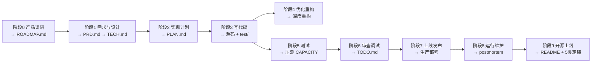

# 开发任务提示词手册（文档先行）

> 按**「从用户的一句话到最终产品」的生命周期**分 10 个阶段，静态计划编排。
> 每个阶段内：**产物越重要，顺序越往后**——前面的产物先执行，作为后面重要产物的参考与输入。
> 例如产品调研阶段：用户访谈、市场调研、技术选型等先做（供参考），最重要的 PRD/ROADMAP 放最后。
> 每条：标题标注产物，下面 `/技能名` + 粘贴即用的提示词。
>
> 理念：**文档先行，代码后行**——先写清楚要做什么，再动手写代码。

## 用法

1. 从【生命周期流程图】定位当前阶段，阶段内按列出顺序执行（前置参考 → ... → 阶段最重要产物）。
2. `/skill-name` 是显式调用；不确定用哪个技能时先 `/using-skills` 路由。
3. 规划用内置 plan 模式（`EnterPlanMode`/`ExitPlanMode`），不是某个技能。
4. 所有提示词默认遵循下方【全局约定】，无需每次重复。

## 生命周期流程



| 阶段         | 前置参考（先执行）                                                     | 阶段最重要产物（最后）              |
| ------------ | ---------------------------------------------------------------------- | ----------------------------------- |
| 0 产品调研   | 用户访谈、深度调研、市场调研、技术选型、开源策略                       | `ROADMAP.md`                      |
| 1 需求与设计 | FEATURES、原型、代码库深化、领域模型、提示词、数据模型、API、UIUX/图片 | `docs/PRD.md` → `docs/TECH.md` |
| 2 实现计划   | .gitignore、CLAUDE.md、文档审计                                        | `docs/PLAN.md`                    |
| 3 写代码     | 轻量变更、解释代码、上下文打包、国际化                                 | TDD 源码 +`test/`                 |
| 4 优化重构   | 性能优化、简化 TODO                                                    | 深度重构架构                        |
| 5 测试       | 验收测试、生成测试、API 集成、前端 E2E                                 | 压测`docs/CAPACITY.md`            |
| 6 审查调试   | 读错误日志、调试、安全审查                                             | `docs/TODO.md`（代码审查）        |
| 7 上线发布   | 依赖升级、提交分支、CI/CD                                              | 上线发布（生产部署）                |
| 8 运行维护   | 文档同步、可观测性、交接                                               | `docs/postmortem/`（事故响应）    |
| 9 开源上线   | 文档重构 5 类定稿、代码审查                                            | `README.md`（oss-polish）         |

---

## 全局约定（最高行为准则，贯穿全流程）

- **纯净原则**：一切代码和文档像第一次写出来的一样——抓根因不打补丁、代码自解释、不留残留文件、部署一致。敢于推倒重写。
- **文档先行**：先 spec/PRD，后代码；先 PLAN，后实现。
- **风格**：明确、简洁、成熟。尽量用 mermaid 图。不要版本号。不要"半成品"字样。
- **提问优先**：需求不明确时**直接问我详细问题**，直到具备一致性和明确性再产出。
- **中文注释**：注释全部中文，重点解释功能；每文件有文件头注释，每关键函数有函数注释；尽量简洁。
- **测试**：测试代码写在 `test/` 目录下。**禁止 mock 测试**，必须真实调用、真实数据。
- **TODO**：代码有待完善处显式加 `TODO` 注释；已完成的 TODO 立即删除。
- **Git**：**绝不自动 `git push`**，所有推送必须人工确认，确保每次 push 的版本可运行。
- **不向后兼容**：尽量简洁，架构明确，不为兼容旧实现留过渡逻辑。
- **审计产报告**：`/documentation-audit` 同步五类正式文档到代码，并产审计报告到 `docs/audit/YYYY-MM-DD-<scope>.md`（范围/before-after/已修复/需人工跟进）。

## 正式文档结构（docs/ 只保留这 5 类，其他合并或删除）

| 文档                                        | 职责           | 风格                                                 |
| ------------------------------------------- | -------------- | ---------------------------------------------------- |
| `docs/PRD.md`（+ `docs/vX.Y/prd.md`）   | 需求           | 项目级简洁多 mermaid（main）；版本级详细（版本分支） |
| `docs/TECH.md`（+ `docs/vX.Y/tech.md`） | 架构           | 项目级简洁多 mermaid（main）；版本级详细（版本分支） |
| `docs/API/*.md`                           | API 契约       | 详细请求/响应（跨版本共享）                          |
| `docs/FLOW/*.md`                          | 业务流程       | mermaid 流程 + 详细数据流描述（跨版本共享）          |
| `docs/TODO.md`                            | 不足与未来方向 | 按业务合并（项目级）                                 |

辅助文档：`ROADMAP.md`（产品定位/多版本/验收项，简洁全局视图）、`docs/PLAN.md`（+ `docs/vX.Y/plan.md`，实现计划）、`docs/FRONT.md`（前端结构审计）、`CLAUDE.md`（AI 上下文）、`README.md`（使用/架构/方向）。调研类中间产物（`docs/research/market.md`、`docs/research/competitor.md`、`docs/research/strategy.md`、`docs/research/interview.md`）是 PRD 输入，上线前清理。

## 命名规则

- **全大写 = 项目级正式文档**（docs/ 根，单文件，main 分支）：`docs/PRD.md`、`docs/TECH.md`、`docs/PLAN.md`、`docs/TODO.md`；根目录 `CONTEXT.md`、`README.md`、`ROADMAP.md`、`CLAUDE.md`。简洁、多 mermaid，是整个项目的视图。
- **全大写目录 = 多文件集合**（docs/ 根，跨版本共享）：`docs/API/`、`docs/FLOW/`。
- **版本目录 = 该版本的详细规格**（`docs/vX.Y/`，版本分支）：`docs/vX.Y/prd.md`、`docs/vX.Y/tech.md`、`docs/vX.Y/plan.md`（小写=详细）。以版本号为开发基准。单版本项目自动回退 `docs/` 根，不建版本目录。
- **阶段目录 = 中间产物按阶段归类**（项目级，跨版本共享）：`docs/research/`（调研类）、`docs/design/`（设计类）、`docs/audit/`（审计报告）、`docs/postmortem/`（事故复盘）。阶段目录内的文件沿用大小写规则——全大写表示该阶段主文档（如 `docs/design/DESIGN.md`），小写表示中间产物（如 `docs/research/competitor.md`）。
- **审计报告 = `docs/audit/YYYY-MM-DD-<scope>.md`**（scope 如 documentation/security/code）：documentation-audit 产物，记录 before/after + 已修复 + 需人工跟进。
- `docs/design/adr/` = 架构/领域决策记录（ADR），architecture 与 domain-modeling 共享，跨版本。
- `docs/security-report.md` = 安全审查报告（docs/ 根小写单文件，verify 类审查产物，非阶段归类）。
- 每个文档型 skill 的产物路径已固化在其 SKILL.md 的 `**Output:**` 声明里。

---

# 阶段 0：一句话 → 产品定位

> 把模糊想法打磨成可执行的产品定位。先用各类调研验证问题真假、收集参考，最后产出 ROADMAP。
> 顺序：用户访谈 → 深度调研 → 市场调研 → 技术选型 → 开源策略 → **ROADMAP**（最重要，最后）。

### 用户访谈验证 — docs/research/interview.md（ROADMAP/PRD 参考）

```
用 Mom Test 方法访谈目标用户：问过去行为不问未来意见，听<20%。5 步：分群→问近期具体经历→问目标与障碍→问替代方案→验证付费意愿。
汇总发现到 docs/research/interview.md（用户原话、行为、痛点、付费意愿），作 ROADMAP/PRD 输入。
访谈法参考 brainstorm 技能的 references/discovery-methods.md（Mom Test 5 步、JTBD switching interview）。
```

### 深度调研（带引用）— docs/research/YYYY-MM-DD-`<slug>`.md（粗需求参考）

```
/research
针对【主题】做深度调研，必须有来源引用，输出带引用的 Markdown（docs/research/YYYY-MM-DD-<slug>.md，作为粗需求参考）。
```

### 市场调研 — docs/research/market.md（ROADMAP/PRD 参考）

```
/market-research
针对【产品方向】做市场调研：用户原话、竞品、行业情报。通过深度检索相关中文社区（LINUX DO、豆瓣、小红书、V2EX 等）收集真实用户原话、行为描述和情绪表达。输出 docs/research/market.md。
```

### 技术选型 / 竞品对比 — docs/research/competitor.md（ROADMAP/PRD 参考）

```
/tech-selection
针对【具体需求】对比可选技术栈/库/框架，输出对比矩阵 + 推荐。输出 docs/research/competitor.md。
```

### 开源策略 — docs/research/strategy.md（ROADMAP/PRD 参考）

```
/oss-strategy
为这个项目制定开源策略：商业模式、open core/COSS、增长路径。输出 docs/research/strategy.md。
```

### 产品定位与路线图 — ROADMAP.md（本阶段最重要产物）

```
/brainstorm
基于上方用户访谈、市场调研、技术选型、深度调研、开源策略的发现，盘问我，把一句话想法打磨成具体产品提案，产出 ROADMAP.md。
```

```
输出 ROADMAP.md：产品定位、目标用户、主要功能、icon。简洁、多 mermaid，是整个项目的全局视图，进 main 分支。
设置多个版本，每个版本列出产品侧的验收项。每个版本的详细 prd/tech/plan 放 docs/vX.Y/（小写，版本分支），以版本号为开发基准。
遵循纯净原则。
```

---

# 阶段 1：定位 → 需求与设计文档

> 把定位转化为可实现的规格。先用各类设计产物收集约束与参考，最后产出 PRD，再由 PRD 驱动 TECH。
> 顺序：FEATURES → 原型 → 代码库深化 → 领域模型 → 提示词 → 数据模型 → API → UIUX/图片 → **PRD → TECH**（最重要，最后）。

### FEATURES.md — 用户可见功能（PRD 参考，便于 e2e 测试）

```
根据 ROADMAP/初步定位输出 FEATURES.md，描述用户可见功能，便于 e2e 测试覆盖，作 PRD 参考。成熟风格，明确简洁。
```

### 原型验证 — docs/design/prototype-findings.md + HTML 原型（PRD 参考）

```
/prototype
针对【设计问题】做一个一次性 HTML 原型（单一文件验证逻辑，或多套可切换 UI 对比）。
原型丢弃，验证结论写入 docs/design/prototype-findings.md，作 PRD/TECH 参考。
```

### 代码库深化 — docs/design/codebase-audit.md（TECH 参考）

```
/codebase-design
审计代码库，找出深化模块/重构/可测试性机会，输出 docs/design/codebase-audit.md，逐个推进我选定的那个。作 TECH 架构参考。
```

### 领域模型 — CONTEXT.md + docs/design/adr/（PRD/TECH 参考，复杂业务才用）

```
/domain-modeling
挑战术语、用场景压测领域模型，输出 CONTEXT.md（统一语言）+ 相关 ADR。作 PRD/TECH 参考。
```

### 提示词设计 — docs/design/PROMPT.md（TECH 参考）

```
/prompt-engineering
设计 LLM 驱动特性的 prompt：prompt 架构、模型选型、guardrails、eval 体系。输出 docs/design/PROMPT.md，作 TECH 参考。
```

### 数据模型设计 — docs/design/SCHEMA.md（TECH 参考）

```
/schema-design
为新功能/限界上下文设计数据模型：实体、关系、范化、索引、约束、分区。输出 docs/design/SCHEMA.md（ER 图 + 实体/索引/约束规划），作 TECH 参考。
```

### API 契约 — docs/API/*.md（PRD/TECH 参考）

```
/api-design
根据 PRD/TECH 设计 API 契约：REST/GraphQL、请求响应、版本、错误模型。输出 docs/API/*.md，详细请求/响应。
```

### UIUX 设计报告 — docs/design/DESIGN.md（PRD 参考，从零设计）

```
/frontend-design
为项目设计 UIUX：设计系统（色彩/字体/间距）、信息架构、交互规范、组件规划。输出 docs/design/DESIGN.md（设计报告），作 PRD 参考。
若用户/上下文未知，先做用户研究（访谈/persona/旅程图/可用性测试），产 docs/research/ux-research.md 作 DESIGN 输入。
需要在线样稿时配合 Figma/Penpot，设计软件与 agent 交互，人工介入审计。根据预先最终产品的版本搭建成熟风格的设计图。
```

### 前端审计 — docs/design/frontend-audit.md（PRD 参考，审计现有前端）

```
/frontend-design
参考 Apple HIG 设计原则，深度审计当前前端布局/组件/字体/样式，给出优化建议。输出 docs/design/frontend-audit.md（审计报告），作 PRD 参考。
```

### 设计参考图 — 品牌/网站/移动端（PRD/DESIGN 参考）

```
/imagegen
为【品牌/网站/移动端】生成设计参考图（mode：brand=logo/身份板/配色；web=每 section 横向图；mobile=屏幕/流程图带 mockup）。高端艺术方向，只出图不写代码。
```

### 设计图转代码 — 前端代码（图片优先管线，DESIGN 参考）

```
/image-to-code
先生成设计参考图，深度分析每张图的布局/配色/字体/交互，再实现代码忠实还原。图片优先管线，非纯代码实现（纯代码用 /frontend-design）。
```

### 需求文档 PRD — docs/PRD.md（项目级，简洁）+ docs/vX.Y/prd.md（版本级，详细）

```
/spec
项目级 docs/PRD.md：简洁、多 mermaid，整个项目的需求视图，进 main 分支。
当前版本 docs/vX.Y/prd.md：详细（用户故事、完整验收准则、规则、边界），进版本分支。
单版本项目回退到 docs/PRD.md 一份即可。中文。直接问我详细的问题，直到需求具备一致性和明确性。
```

定稿流程：初稿 PRD → 阶段 0 的市场/技术/深度调研 → 人+AI 审计完善不明确需求 → `/spec` 输出最终 PRD。

### 架构文档 TECH — docs/TECH.md（项目级，简洁）+ docs/vX.Y/tech.md（版本级，详细）

```
/architecture
项目级 docs/TECH.md：简洁、多 mermaid，整个项目的架构视图，进 main 分支。
当前版本 docs/vX.Y/tech.md：详细架构，进版本分支。单版本项目回退到 docs/TECH.md 一份即可。
包含 ADR 与架构图。综合上方领域模型、数据模型、API、代码库审计等设计产物，形成最终架构。
```

---

# 阶段 2：设计 → 实现计划

> 把设计文档拆解为可执行的开发计划与项目脚手架。先搭好项目环境与上下文，最后产出 PLAN。
> 顺序：.gitignore → CLAUDE.md → 文档审计 → **PLAN**（最重要，最后）。

### .gitignore — 忽略规则（PLAN 前置：项目环境）

```
请完善 .gitignore，添加需要忽略的文件，确保仓库简洁。不要完全覆盖现有配置，从文件末尾追加。
```

### CLAUDE.md — 项目专属上下文（PLAN 前置：AI 上下文，开发前生成）

```
/init
```

或用文末【CLAUDE.md 生成提示词】——只产项目强相关部分（Role / Project / Stack / Structure / Commands / 项目约定 / 项目边界 / 5 类正式文档），追加到通用模板之后；通用模板只含工程原则，不重复。

### 文档一致性审计 — 同步所有文档（PLAN 前置：文档就绪）

```
/documentation-audit
审计并同步五类正式文档（PRD/TECH/API/FLOW/TODO）到代码，产审计报告到 docs/audit/YYYY-MM-DD-documentation.md。明确简洁，不需要版本号。
```

### 实现计划 PLAN — docs/PLAN.md（项目级，简洁）+ docs/vX.Y/plan.md（版本级，详细）

```
/breakdown
项目级 docs/PLAN.md：简洁、多 mermaid，整个项目的计划视图，进 main 分支。
当前版本 docs/vX.Y/plan.md：详细 ticket 拆解（标题、blocked by、交付物、按阻塞排序），进版本分支。
单版本项目回退到 docs/PLAN.md 一份即可。中文。直接问我详细的问题，直到一致性和明确性。
第一版优先搭好模板职责和项目架构，不追求细节完成，追求整体系统结构。
综合 PRD/TECH 及上方就绪的项目环境，形成可执行的开发计划。
```

---

# 阶段 3：计划 → 代码

> 按计划逐文件实现。先处理轻量变更、代码理解、上下文打包等辅助工作，最后 TDD 主线实现。
> 顺序：轻量变更 → 解释代码 → 上下文打包 → 国际化 → **TDD 源码**（最重要，最后）。

### 轻量变更 — 源码（不需要 spec 的小任务）

```
/implement
这是轻量变更（改配置/重命名模块/移文件/加字段/搭项目骨架），没有设计决策。
直接做：读相关文件 → 改 → 跑 typecheck + 受影响测试。若开始触及 3+ 文件或跨模块边界，升级到 /spec。
```

### 解释代码 / 代码库导览 — 理解现有代码（TDD 前置：理解既有代码）

```
/context-engineering
解释【这段代码/模块】怎么工作，或带我过一遍整个代码库。面向人讲解，不只是给 agent 打包上下文。
```

### 缺上下文时打包 — 工作上下文（TDD 前置：组装上下文）

```
/context-engineering
为当前实现任务组装正确文件、定义和既有决策，打包进工作上下文。
```

### 国际化 — 代码 + locale 配置（TDD 前置：locale 面）

```
/i18n
审计当前 locale 面（硬编码串、格式化、布局假设），提取消息到 locale 文件，用 ICU MessageFormat 处理复数/性别，
设 locale 路由，处理 RTL 和本地化格式。在至少一个 RTL locale 下测试。
```

### 逐小步实现（TDD）— 源码 + test/（本阶段最重要产物，最后）

```
/tdd
@docs/PLAN.md 按计划逐文件实现。严格按照计划完成代码文件编写，测试代码写在 test/ 下。
有依赖要提前配置。代码有待完善处加 TODO 注释。禁止 mock 测试。
```

---

# 阶段 4：代码 → 优化与重构

> 先量后优；修复 TODO；必要时深度重构架构。

### 性能优化 — PERF.md（可选）+ 定点修复

```
/performance
先 profile 找瓶颈，再针对性优化。输出 profile 结果 + 定点修复。禁止凭感觉优化。
```

### 简化代码 — 修复 TODO

```
/simplify
@TODO.md 标识已完成项（打勾），修复待办，修复完移除相关 TODO 注释。
不要向后兼容，尽量简洁，架构明确。更新文档一致性。
```

### 深度重构架构 — 重构后代码

```
/codebase-design
深度审计架构，产出深化机会与选定候选（docs/design/codebase-audit.md）。
```

```
/refactoring
根据上方 /codebase-design 的审计，执行结构重构（提取/移动/拆合并/改依赖），保留行为。不要向后兼容，架构明确。
```

---

# 阶段 5：代码 → 测试

> 证明它能跑。先做验收与单元测试打底，再集成、E2E，最后压测探容量上限。
> 顺序：验收测试 → 生成测试 → API 集成 → 前端 E2E → **压测 CAPACITY**（最重要，最后）。

### 验收测试 — test/ 验收数据与步骤（压测前置：验收基线）

```
生成验收测试步骤，输出到根目录 test/ 目录，包含验收所需测试数据、用例和描述测试步骤的文档。
以数据库所有字段为参考，检查每个字段在后端是否有处理、有体现。禁止 mock，需要真实业务过程。
```

### 生成测试 — test/ 测试文件（压测前置：单元覆盖）

```
/test-generation
为【功能/文件】生成测试，覆盖用例矩阵。测试写在 test/ 下，禁止 mock，确保真实调用。
```

### API 集成测试 — test/ 集成测试（压测前置：后端集成）

```
/api-testing
分步骤，不要分支。本地运行后端。
根据所有 API 文档审计并完善后端集成测试，然后运行测试。
检查日志文件和后端 docker 日志以排查错误，不要阻塞太久。
将测试输出保存到临时文件，禁止 mock 测试。
优先检查测试代码，最后修改后端代码，测试完恢复原有状态。
```

### 前端 E2E + API 集成测试 — test/ E2E 测试（压测前置：端到端）

```
/e2e-testing
/api-testing
完善所有前端 API 测试代码和业务 E2E 测试代码。
后端本地运行，前端直接发 API 请求验证响应。
检查日志和 docker 日志排查错误，禁止 mock。
优先检查测试代码，最后修改前端代码，测试完恢复原有状态。
```

### 压测 / 容量验证 — test/ 脚本 + docs/CAPACITY.md（本阶段最重要产物，最后）

```
/load-testing
先定容量目标（RPS、p99、错误率、破坏阈值），设计真实流量画像，用 k6/Locust 等工具跑 ramp/soak/spike/stress。
找到破坏点和饱和资源，验证自动伸缩，产出测试脚本(test/) + 容量报告（docs/CAPACITY.md）。
```

---

# 阶段 6：测试 → 审查与调试

> 合并前。先做日志 triage、调试、安全审查，最后全量代码审查产出 TODO.md。
> 顺序：读错误日志 → 调试 → 安全审查 → **代码审查 TODO.md**（最重要，最后）。

### 读错误日志 / 日志排查 — triage 结论（代码审查前置：排障）

```
/debugging
读这个错误日志/输出，告诉我是什么问题。先做日志 triage：读全错误 → 判错误类 → 追到代码的 file:line → 一句假设。
若属逻辑/运行时 bug，再升级到完整复现循环；若是配置/资源/权限类，直接修。
```

### 调试 — 找根因不贴补丁（代码审查前置：修 bug）

```
/debugging
【bug 现象】。走红循环 → 最小复现 → 假设 → 插桩 → 修复 → 回归测试。找根因，不贴补丁。
```

### 安全审查 — docs/security-report.md（代码审查前置：安全闭环）

```
/security-review
审查本次改动：密钥、鉴权、注入、访问控制、加固。输出安全发现报告（docs/security-report.md）。
```

### Lint / 静态分析 — lint 修复 + 配置收紧（代码审查前置：机器门禁）

```
/linting
跑项目 linter/静态分析，按规则分类修复真实问题，误报窄域抑制并写理由，反复出现的噪音收紧配置。本地命令须与 CI 一致。
```

### 代码审查 — docs/TODO.md（本阶段最重要产物，最后，每个大里程碑）

```
/code-review
深度检索前后端代码，每个代码文件都要查看到，给出优化建议。
待优化的地方加 TODO 注释，已完成的 TODO 删除。确保代码简洁、规范、严谨。
输出 docs/TODO.md（按业务合并，成熟风格，全量 TODO 注释一致性审计：代码 ↔ TODO.md 双向校验）。
```

---

# 阶段 7：审查 → 上线与发布

> 干净提交、流水线、灰度上线。先处理依赖升级、提交、CI/CD，最后上线发布。
> 顺序：依赖升级 → 提交分支 → CI/CD → **上线发布**（最重要，最后）。

### 依赖升级 — 升级后代码（上线前置：依赖就绪）

```
/deprecation-migration
升级【依赖名】到【目标版本】。先读 changelog/migration guide 找 breaking changes，
检查我的用法，在分支上升级，修每个 break 的根因（不抑制类型错误），
验证行为不只类型，升级单独提交。若 breaking changes 相当于重新设计用法，升级到完整迁移流程。
```

### 提交与分支 — 干净提交（上线前置：版本控制就绪）

```
/git-workflow
提交本次改动，按意图解决冲突，绝不 --abort。干净提交。
```

### CI/CD — 流水线配置 + 策略（上线前置：自动化就绪）

```
/ci-cd
设计构建/测试/部署流水线与部署策略。输出流水线配置 + 策略。
```

### 上线发布 — 生产部署（本阶段最重要产物，最后）

```
/shipping
上线到生产：清单、特性开关、灰度、回滚预案、上线首小时验证。越快越安全。
```

---

# 阶段 8：上线 → 运行维护

> 文档同步、可观测性、事故响应、交接。先做日常运维与交接，最后事故响应（最高纪律要求）。
> 顺序：文档同步 → 可观测性 → 交接 → **事故响应 postmortem**（最重要，最后）。

### 文档同步 — 5 类文档一致（事故响应前置：文档就绪）

```
/documentation-audit
根据当前代码同步五类正式文档：prd/tech/todo/api/flow 保持一致。产审计报告到 docs/audit/YYYY-MM-DD-documentation.md。语言干练简洁，成熟风格。
```

### 可观测性 — 插桩 + 上线前清单（事故响应前置：可观测）

```
/observability
为系统加日志/指标/告警/插桩，让运行时行为可观测。输出插桩 + 上线前清单。
```

### 交接 — 交接简报（事故响应前置：上下文传递）

```
/handoff
把当前工作交接给下一个会话/agent：上下文、决策、下一步。输出交接简报。
```

### 事故响应 — docs/postmortem/YYYY-MM-DD-`<slug>`.md（本阶段最重要产物，最后）

```
/incident-response
生产事故响应：5 分钟内定严重度，先遏制（回滚/关开关/降级）不先诊断，建立沟通节奏，遏制后再找根因，
修复后验证指标回基线，48 小时内写无指责复盘（docs/postmortem/YYYY-MM-DD-<slug>.md）。
```

---

# 阶段 9：产品 → 开源上线

> 美化展示面、5 类文档定稿、最终代码审查。先把文档与代码收尾，最后美化展示面。
> 顺序：文档重构 5 类定稿 → 代码审查 → **oss-polish README**（最重要，最后）。

### 开源上线文档重构 — 5 类文档定稿（oss-polish 前置：文档就绪）

```
/documentation-audit
文档 docs/ 只保留：prd/tech/todo/api/flow 五类，其他合并或删除。
重构要求：
- prd、tech 以 mermaid 图为主，文字简洁，成熟风格。
- todo 包括当前系统的不足和未来项目的开发方向。
- api 包括详细请求响应。
- flow 包含各个业务 mermaid 流程和详细数据流描述。
重视一致性，语言干练简洁。
更新 README（简洁描述使用方法、架构和功能，要有项目未来方向）。
删除无关文件（旧版本遗留，只保留必要文件）。所有文档字眼简洁成熟，不要无关字眼（如版本）。
```

```
/code-review
深度检索前后端代码，每个代码文件都要查看。待优化处加 TODO 注释，已完成的删除。
输出 docs/TODO.md：按业务合并，成熟风格，全量 TODO 注释一致性审计（代码 ↔ TODO.md 双向校验），更新相关文档确保一致性。
```

### 开源项目上线准备 — README.md + REPOSITORY_SUMMARY.md + THE_STORY_OF_THIS_REPO.md（本阶段最重要产物，最后）

```
/oss-polish
开源项目上线准备：美化 README（简洁，突出项目特色与未来方向，几个 TODO 大方向），
GitHub About + Topics 用 gh 配置。
清理无关文件，确保仓库简洁，文档不要出现半成品字样，代码注释不体现文档字样，正式成熟风格，禁止补丁式补全。
```

---

# 横切任务（任意阶段可用，不在线性主线）

> 这些任务不绑定特定阶段，按需在任意时点执行。

### 业务流程文档 — docs/FLOW/*.md

针对系统每个业务流程写一份文档，含 mermaid 图 + 详细数据流描述。

```
结合已有图表，针对每个业务数据流创建 mermaid 图（简洁，体现架构即可），每个图配详细文字描述。
然后按业务划分、针对后端详细 API 端点，描述从输入到输出的完整数据流，必须体现分层架构
（接入层/业务层/数据层），明确每步调用的具体函数名（含类/模块前缀）。
格式：
  输入：<原始输入数据描述>
  1. 经由 <函数全名A> 处理，产出 <中间结果A描述>
  2. 经由 <函数全名B> 处理，产出 <中间结果B描述>
  输出：<最终输出数据描述>
约束：每步写出实际函数名（如 UserController.login()、AuthService.verifyToken()、UserRepository.save()）；
分层架构在步骤中自然体现；分支/异步按主路径描述并注明关键分支；避免抽象概括，细化到每个有业务意义的函数调用。
```

### 前端结构审计 — docs/FRONT.md

```
阅读整个前端项目，输出 docs/FRONT.md，明确每个步骤调用的具体组件名对应文件：
1. 目录结构 → 对应访问路由
2. server/client 组件划分
3. API 接口数据流向
4. 全局布局 & 公共组件复用
5. 启动命令与依赖配置
约束：清晰简洁越详细越好；每步写出实际函数名；分层架构自然体现；分支按主路径描述并注明。
```

### 全量 TODO 审计 — docs/TODO.md

```
/code-review
深度检索前后端代码，每个代码文件都要查看。待优化处加 TODO 注释，已完成的删除。
输出 docs/TODO.md：按业务合并，成熟风格，全量 TODO 注释一致性审计（代码 ↔ TODO.md 双向校验），更新相关文档确保一致性。
```

### 修复 TODO — 清理待办并 push

```
/simplify
@TODO.md 标识已完成项（打勾），修复 todo，修复完移除相关 TODO 注释。
不要向后兼容，尽量简洁，架构明确。更新文档一致性。最后 push（需人工确认）。
```

```
以数据库的所有字段为参考，检查所有字段在后端是否有处理、有体现。禁止 mock，需要真实业务过程。完成后 push。
```

### 重构闭环 — 审计→重构→复审→同步文档

```
/codebase-design
深度审计后端架构，优化使架构完善，禁止硬编码。
```

```
/simplify
根据报告完全重构。
```

```
/code-review
审计这次的重构。
```

```
/documentation-audit
更新所有 api 文档和所有文档，成熟风格，无关版本。
```

### GitHub Wiki — 仓库 wiki

```
全面审计仓库，创建详细的 GitHub 仓库 wiki。
```

### 教程文档 — 多文件教程

```
每个主题一个文件夹下多个 md，每个 md 体量尽量小。多 mermaid，多一小段话，少大段话和专业术语；
涉及术语必须解释；整体介于大白话和专业术语之间；大标题用术语概述，解释性语言用通俗语言；
要有示例；要有实践项（不能编造，在网上找相应实践项，必须有好的对照组建立评判标准）；要有充分参考资料。
```

### 调研报告 — docs/research/YYYY-MM-DD-`<slug>`.md

```
/research
清晰编号主线（1概述→2关系→3实现→4能力→5局限→6评估→7索引），mermaid 图密集
（flowchart/sequence 混用），表格密集，每节短句，术语带通俗解释。
解析性问题以使用者角度展开，先讲清"能拿它满足什么需求、能不能用"，再展开实现。
```

### 博客 — 博客文章

```
清晰主线，多 mermaid 图，多短语，术语通俗易懂解释，要有真实参考资料。
```

---

# CLAUDE.md 生成提示词（开发前生成 · 仅项目强相关）

> 产出项目根目录 CLAUDE.md 的**项目专属内容**，追加到通用模板之后。
> 通用模板只含工程原则（纯净原则 / 全局约定），项目无关，**此处不重复**。
> 文档结构 / 版本分层 / 技能包路由是 pack 约定，不写入项目 CLAUDE.md。
> 时机：PRD/TECH 就绪后、写代码前（阶段 2 起手）。

```
为当前项目生成 CLAUDE.md 的**项目专属内容**，追加到通用模板之后。通用模板只含工程原则（纯净原则、全局约定），禁止重复。文档结构 / 版本分层 / 技能包路由是 pack 约定，不写入项目 CLAUDE.md。只根据 PRD/TECH/代码库现状提炼本项目强相关上下文。体现实际技术栈，不用泛泛表述。简洁，英文。

## 必含章节（仅项目强相关，顺序如下）
1. **Role** — AI 在本项目的身份，绑定实际技术栈（如 "You are a senior {React + FastAPI} engineer on this project"）
2. **Project** — 项目名 + 一句话描述（是什么、给谁用）
3. **Stack** — 语言 / 框架 / 核心库 / 运行时 / 包管理器（实际版本）
4. **Structure** — 关键目录及职责（如 src/engine, src/cli, docs/, test/）
5. **Commands** — dev / build / test / lint 实际命令
6. **Project conventions** — 本项目特有约定（从 PRD/TECH 提炼：架构决策、API 风格、状态管理、数据层规则等；通用约定已在模板不写）
7. **Project boundaries** — 本项目级「始终要做 / 绝不要做」（如「禁止改 generated/」「迁移走 make migrate」；通用约定已在模板不写）
8. **Formal docs** — 指向 docs/ 下 5 类正式定稿文档：PRD / TECH / API / FLOW / TODO（收尾工作，不提开发阶段产物 PLAN / research / design / vX.Y）

## 约束
- 禁止重复通用模板的工程原则（纯净原则、全局约定）。
- 不写文档结构表 / 版本分层 / 技能包路由——pack 约定，非项目 CLAUDE.md 内容。
- docs/ 只提 5 类正式文档，不提开发阶段产物。
- 通用提示词，适用任意项目；输出仅含项目强相关原则。
- 体现实际技术栈，命令 / 目录据实定制，禁止泛泛表述。
- 简洁，英文，与通用模板一致。

## 输入（请据实填写）
- 项目名称及一句话描述：{...}
- 核心技术栈：{如 TypeScript, React, FastAPI, PostgreSQL}
- 运行时 / 环境：{如 Node.js >=22.13.0, Python 3.12}
- 主要目录：{如 src/engine, src/cli, docs/, test/}
- 常用命令：{如 npm run dev, npm test}
- 项目特有约定：{如事件溯源、API 前缀 /api/v1、状态用 Zustand}
- 项目级边界：{如禁止改 generated/、迁移走 make migrate}

请直接输出项目专属 CLAUDE.md 内容（仅上述章节，英文，简洁），追加到通用模板之后。
```

---

> 路由不确定时：`/using-skills`。规划：内置 plan 模式。交接：`/handoff`。
