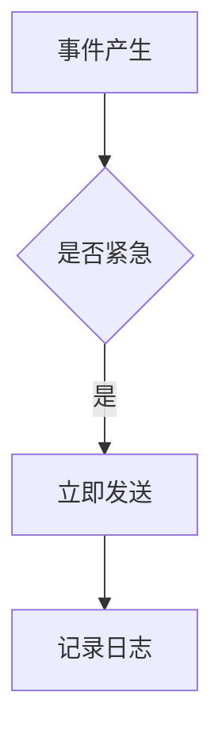

# 智能通知系统 PRD（混乱版）

**快速、稳定、好用的通知系统！** 我们要做市面上最快的通知。用户说体验要流畅，一定要快，绝对不能慢。

## 背景

目前系统消息混乱，用户抱怨收不到消息。我们要做通知中心。王总上次说这个事情很重要。

## 功能需求

系统支持邮件、短信、App 推送三种通知方式。邮件要快。短信要快。推送也要快。所有通知都必须稳定可靠，不能丢。

| 功能 | 触发 | 行为 | 输出 | 异常处理 | 权限控制 | 通知渠道 | 重试策略 | 成本核算 | 运营备注 | 优先级 | 状态 |
|---|---|---|---|---|---|---|---|---|---|---|---|
| 系统公告 | 管理员发布 | 全员推送 | 站内+推送 | 稍后重试 | 管理员 | 全渠道 | 3次 | 待定 | 运营确认 | P0 | 进行中 |
| 订单通知 | 下单成功 | 发送确认 | 邮件+短信 | 失败告警 | 用户本人 | 邮件短信 | 5次 | 待定 | — | P0 | 进行中 |

频率限制规则：每用户每天最多接收 100 条营销类通知。

通知频控说明：为避免骚扰，每个用户每日接收的营销通知数量不得超过 100 条（同上，见频率限制规则）。

（B 的"否"分支未画出后续处理。）

## 其他

竞品 A 的送达率据说是 99.99%，我们也要做到。费用方面王总之前好像提过一个数，具体记不清了，先按够用来。

上线时间：尽快。
