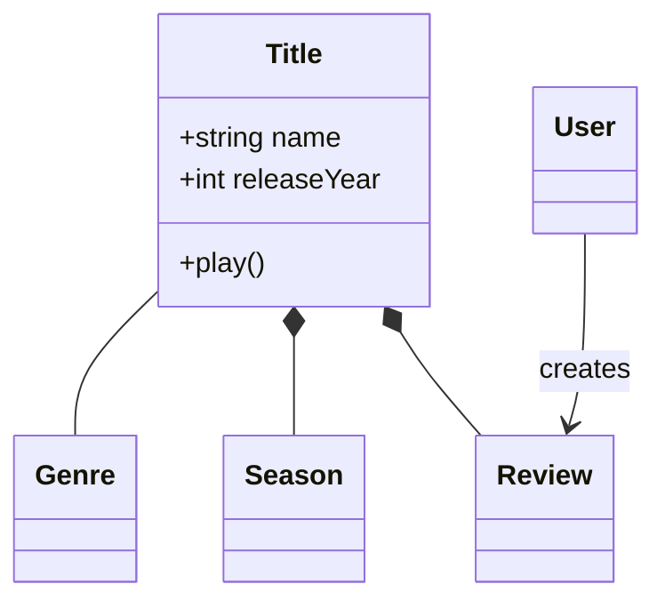
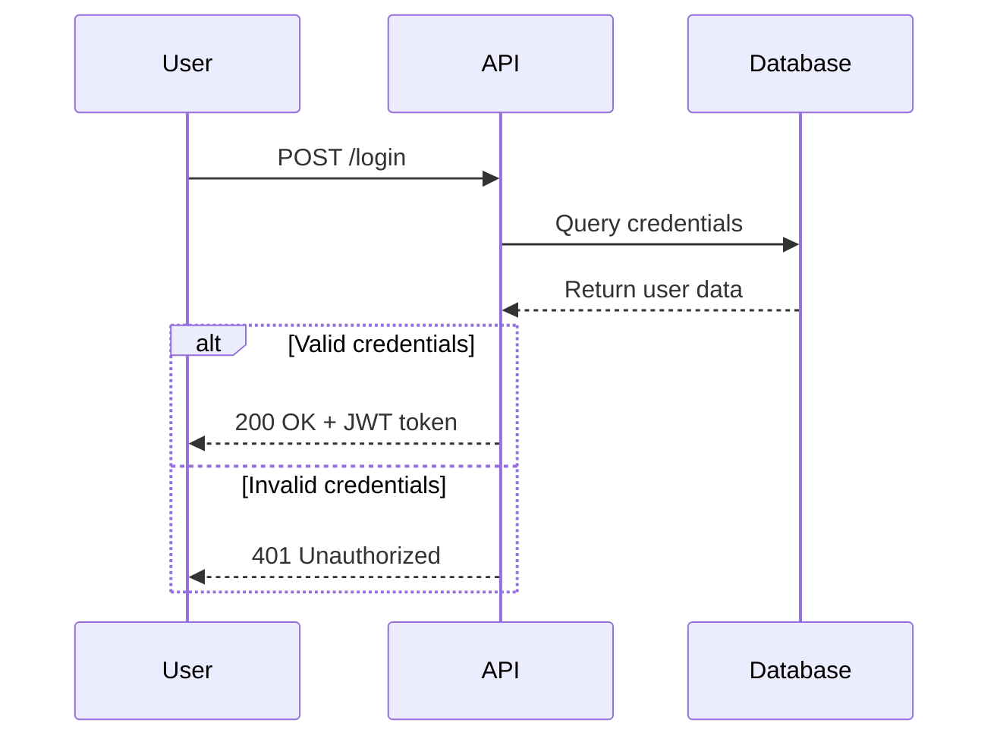
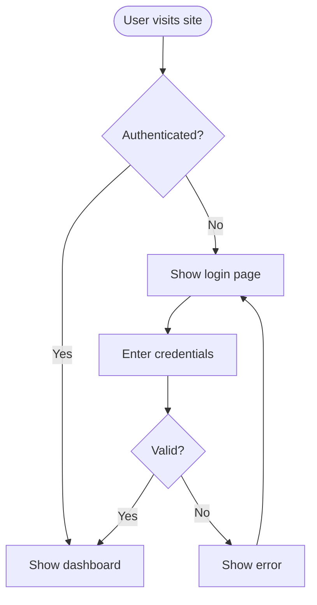
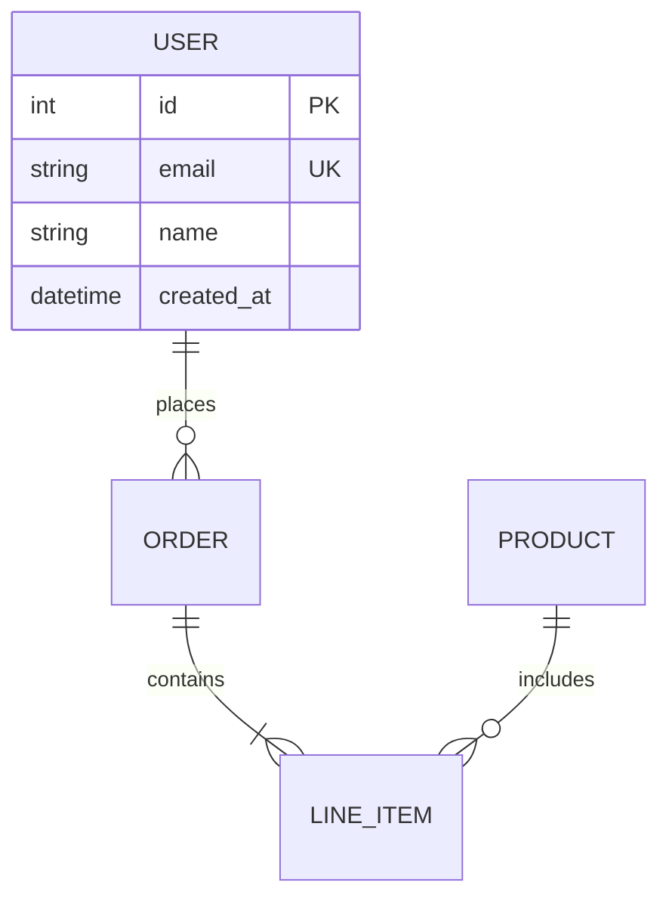
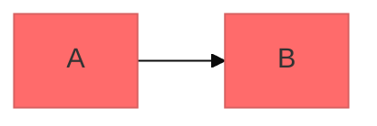

# Mermaid Diagrams

Create professional software diagrams using Mermaid's text-based syntax. Diagrams render from
simple text definitions, making them version-controllable and maintainable alongside code.
Loaded on demand by `architecture`, `code-review`, `domain-modeling`, and any skill that needs
to visualize structure.

## Contents

- [Core Syntax](#core-syntax)
- [Diagram Type Selection](#diagram-type-selection)
- [Quick Start](#quick-start)
- [Detailed References](#detailed-references)
- [Best Practices](#best-practices)
- [Configuration and Theming](#configuration-and-theming)
- [Rendering](#rendering)
- [Common Pitfalls](#common-pitfalls)
- [When to Create Diagrams](#when-to-create-diagrams)

## Core Syntax

All Mermaid diagrams follow this pattern:

```mermaid
diagramType
  definition content
```

- First line declares diagram type (`classDiagram`, `sequenceDiagram`, `flowchart`, …).
- `%%` for comments.
- Line breaks and indentation improve readability but aren't required.
- Unknown words break diagrams; parameters fail silently.

## Diagram Type Selection

1. **Class Diagrams** — domain modeling, OOP design, entity relationships.
2. **Sequence Diagrams** — temporal interactions, message flows, API/auth sequences.
3. **Flowcharts** — processes, algorithms, decision trees, user journeys.
4. **ERD** — database schemas, table relationships, data modeling.
5. **C4 Diagrams** — architecture at System Context / Container / Component / Code levels.
6. **State Diagrams** — state machines, lifecycle states.
7. **Git Graphs** — version-control branching strategies.
8. **Gantt Charts** — project timelines, scheduling.
9. **Pie/Bar Charts** — data visualization.

## Quick Start

### Class Diagram (Domain Model)


### Sequence Diagram (API Flow)


### Flowchart (User Journey)


### ERD (Database Schema)


## Detailed References

For in-depth guidance on specific diagram types, see `mermaid/`:
- `mermaid/class-diagrams.md` — relationships, multiplicity, methods/properties.
- `mermaid/sequence-diagrams.md` — actors, messages, activations, loops, alt/opt/par.
- `mermaid/flowcharts.md` — node shapes, connections, subgraphs, styling.
- `mermaid/erd-diagrams.md` — entities, cardinality, keys, attributes.
- `mermaid/c4-diagrams.md` — context, container, component, boundaries.
- `mermaid/architecture-diagrams.md` — cloud services, infrastructure, CI/CD.
- `mermaid/advanced-features.md` — themes, styling, configuration, layout.

## Best Practices
1. **Start simple** — core entities first, add detail incrementally.
2. **Meaningful names** — clear labels make diagrams self-documenting.
3. **Comment** — use `%%` to explain complex relationships.
4. **One concept per diagram** — split large diagrams into focused views.
5. **Version control** — store `.mmd` files alongside code.
6. **Add context** — titles and notes explain purpose.

## Configuration and Theming

Themes: default, forest, dark, neutral, base. Layout: `dagre` (default), `elk` (complex). Look: `classic`, `handDrawn`.

## Rendering
- **Native:** GitHub/GitLab (auto-render in Markdown), VS Code (Mermaid extension), Notion, Obsidian, Confluence.
- **Export:** [Mermaid Live Editor](https://mermaid.live) (PNG/SVG); CLI `npm install -g @mermaid-js/mermaid-cli` then `mmdc -i input.mmd -o output.png`.

## Common Pitfalls
- Avoid `{}` in comments; escape special characters.
- Misspellings break diagrams — validate in Mermaid Live.
- Split complex diagrams into focused views.
- Document all important connections.

## When to Create Diagrams
Starting new projects/features, documenting complex systems, explaining architecture decisions,
designing database schemas, planning refactoring, onboarding. Use diagrams to align stakeholders,
document domain models collaboratively, visualize data flows, and plan before coding.
