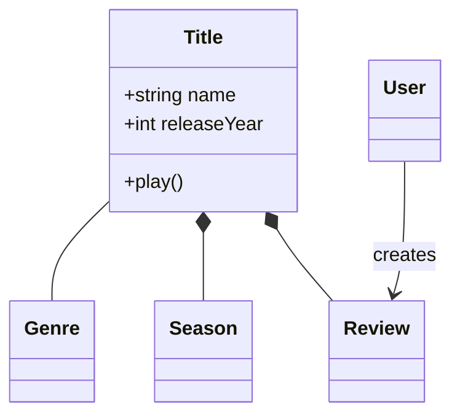
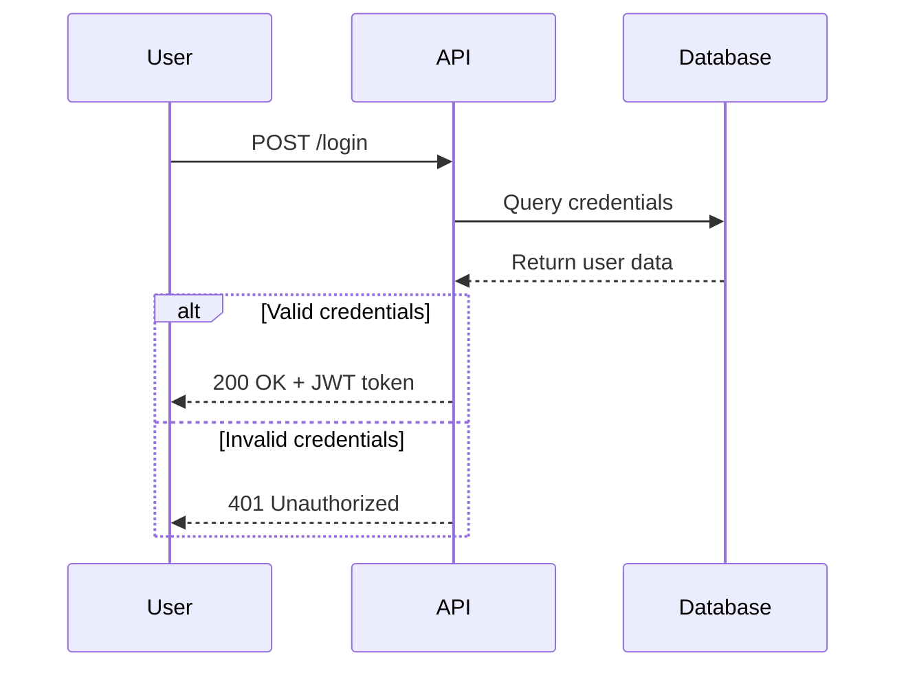
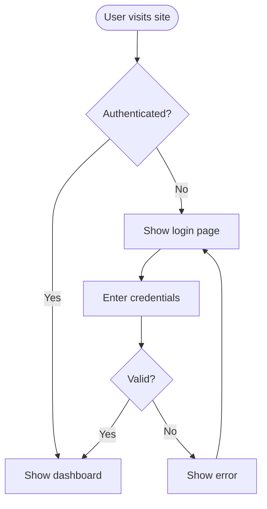
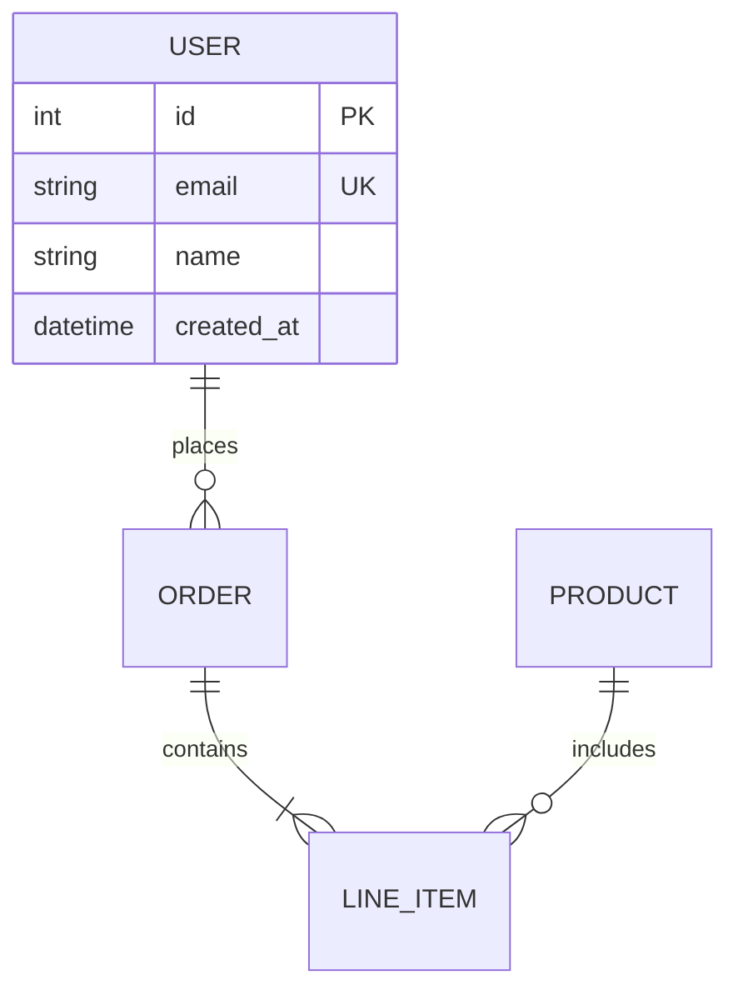
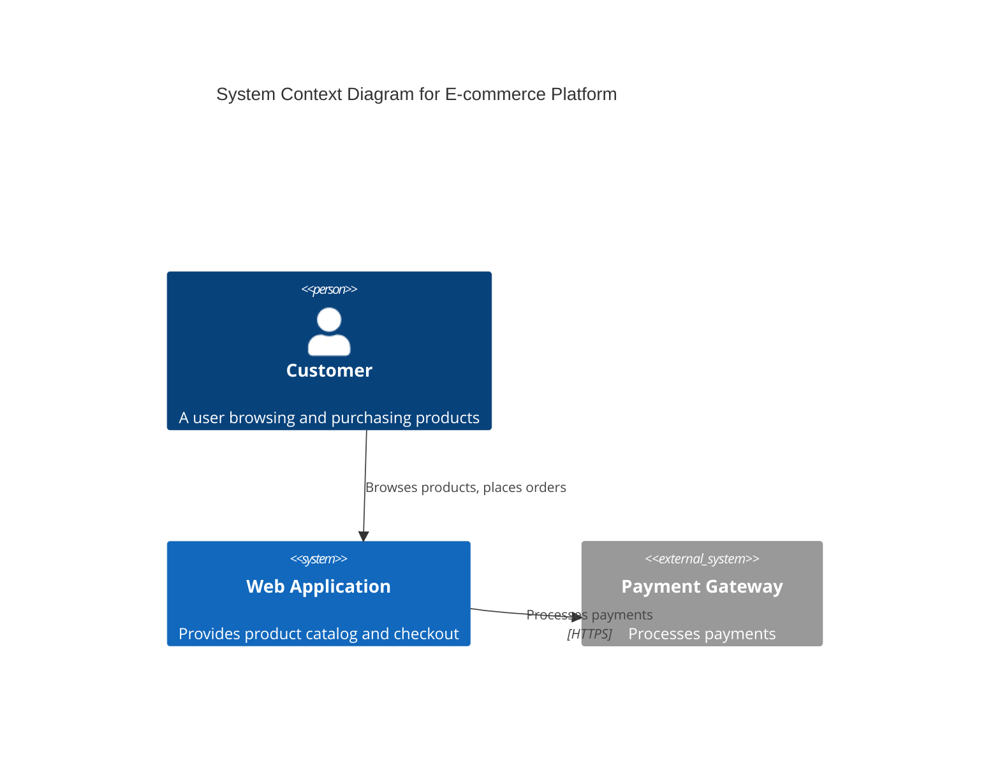

# Mermaid Diagrams Reference

A reference for creating software diagrams using Mermaid syntax. Covers diagram types, syntax,
styling, and examples. Diagrams are rendered from text definitions, making them easy to version
alongside code and review in pull requests.

## Diagram type index

| Type | Reference file | Use |
|------|---------------|-----|
| Class diagrams | [class-diagrams.md](class-diagrams.md) | Domain models, OOP design, entity relationships |
| Sequence diagrams | [sequence-diagrams.md](sequence-diagrams.md) | API flows, user interactions, temporal sequences |
| Flowcharts | [flowcharts.md](flowcharts.md) | User journeys, processes, decision logic, pipelines |
| ER diagrams | [erd-diagrams.md](erd-diagrams.md) | Database schemas, table relationships, cardinality |
| C4 architecture | [c4-diagrams.md](c4-diagrams.md) | System context, containers, components |
| Architecture diagrams | [architecture-diagrams.md](architecture-diagrams.md) | Cloud services, infrastructure, CI/CD deployments |
| Advanced features | [advanced-features.md](advanced-features.md) | Themes, styling, configuration, layout options |

## Quick syntax

```mermaid
diagramType
  definition content
```

GitHub and GitLab render Mermaid blocks in `.md` files automatically.

## Examples

### Domain model



### API authentication flow



### User journey



### Database schema



### System context (C4)



## Advanced capabilities

- **Themes** — default, forest, dark, neutral, base; or custom (colors, fonts, layout)
- **Layout** — Dagre (balanced) or ELK (advanced)
- **Look** — classic or hand-drawn sketch style
- **Subgraphs** — group related elements for clarity
- **Notes** — add context with `%%` comments
- **Flow control** — alt/loop/opt blocks in sequence diagrams

## Best practices

1. **Start simple, iterate** — begin with core elements, add complexity gradually.
2. **One diagram, one concept** — keep diagrams focused; split large views.
3. **Meaningful names** — clear labels make diagrams self-documenting.
4. **Comment liberally** — use `%%` to explain non-obvious relationships.
5. **Version control** — store `.mmd` files with code; update as the system evolves.
6. **Validate syntax** — test in [Mermaid Live Editor](https://mermaid.live) before committing.
7. **Keep it readable** — don't overcrowd; split into multiple diagrams if needed.

## Tools

- [Mermaid Live Editor](https://mermaid.live) — interactive editor with instant preview and export
- [Official documentation](https://mermaid.js.org) — comprehensive syntax reference
- Mermaid CLI — `npm install -g @mermaid-js/mermaid-cli` for batch exports
- VS Code — "Markdown Preview Mermaid Support" extension for live preview
