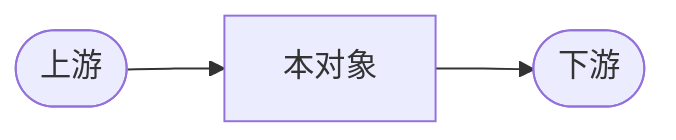

# General mode

Reference for the `research` skill, **general** mode. Deep multi-source web research with inline
citations and a 7-section cited Markdown report.

## Source strategy

Fan out across ≥3 query angles and ≥3 source categories:
- Official docs, project blogs, papers, release notes, GitHub repos.
- Default depth for broad topics: ≥6 relevant sources. For narrow topics, state why fewer suffice.
- For repository sources, collect: URL, description, language, stars, forks, open issues, last updated date, fit for the user's goal.
- Collect both Chinese and English sources.

## Quality rules

- Fast-moving topics: use fresh sources with exact dates; flag stale data.
- Repository lists: do not sort by stars alone; weigh maintenance, docs quality, issue health, scope fit, integration cost.
- Distinguish tutorial content from production guidance; mark vendor-blog bias.
- Delete unsupported claims or label them as inference.
- Cite at the point where the claim appears, not only in the source appendix.

## 7-section output template

Keep numbering continuous (1→7, no gaps or reuse). Trim sections to fit the topic, but keep order.

| # | Section | Purpose |
| --- | --- | --- |
| 1 | 概述 | Goal, current state, research method |
| 2 | 关系 | Upstream/downstream, related standards/platforms |
| 3 | 实现 | Structure, selection, workflow |
| 4 | 能力 | Tool/component inventory, artifacts |
| 5 | 局限 | Capability boundaries, fallback paths |
| 6 | 评估 | Decision summary, tradeoff analysis, QA |
| 7 | 索引 | Source references, glossary, gaps/follow-ups |

- Inline-cite at each claim (`[text](url)`).
- ≥3 mermaid diagrams mixing `flowchart` (decisions/routing/fallbacks) and `sequenceDiagram` (timing/call chains). Diagrams serve information — never decorate.
- Tables for comparisons, lists, decisions; prefer tables over prose. One sentence per idea.
- Inline-explain jargon on first use (`> **Term·X**: plain-language explanation`); aggregate glossary in §7.

### Skeleton

````markdown
# [研究标题]
生成日期：YYYY-MM-DD
范围：[检索了什么、排除了什么]

## 1. 概述
### 1.1 目标
[一两句说明这次调研要解决什么。]
### 1.2 调研方法
[查询角度 / 源类别。]

## 2. 关系


## 3. 实现
| 选项 | 关键属性 | 适配度 |
| --- | --- | --- |
| … | … | … |

## 6. 评估
| # | 问题 | 决策 | 依据 |
| --- | --- | --- | --- |
| 1 | … | … | [来源](url) |

## 7. 索引
### 7.1 源参考
- [标题](url) — 日期。可靠性：一级/二级。支持：[论点]。
- 访问日期：YYYY-MM-DD。
### 7.2 术语表
| 术语 | 通俗解释 |
| --- | --- |
| … | … |
````
