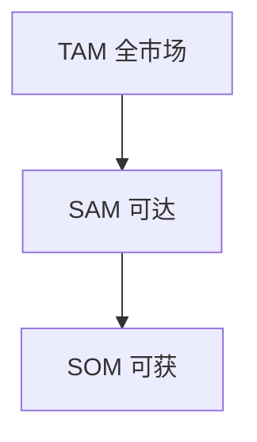

# Market mode

Reference for the `research` skill, **market** mode. Market sizing, competitor comparisons,
investor due diligence, industry intelligence, fund research, and technology scans that inform
business decisions. Uses the shared spine — see [references/report-spine.md](report-spine.md) for
the fixed structure, main-thread rule, mermaid rules, and shared skeleton.

## Contents

- [Research standards](#research-standards)
- [Source priority](#source-priority)
- [The 4 sub-modes](#the-4-sub-modes)
- [9-section output template](#9-section-output-template)
- [Verify (market mode)](#verify-market-mode)

## Research standards

- Every important claim needs a source.
- Prefer recent data; call out stale data explicitly.
- Include contrarian evidence and downside cases.
- Translate findings into a decision, not just a summary.
- Separate fact, inference, and recommendation clearly.

## Source priority

| Priority | Source type | Use |
| --- | --- | --- |
| P0 | SEC filings, public datasets (census, registry), investor/fund databases | Hard numbers, fund terms, ownership |
| P1 | Market reports (Gartner, IDC, CB Insights), analyst research, prospectuses | Market size, segmentation, forecasts |
| P2 | Press releases, company blogs, Crunchbase, funding announcements | Traction, positioning, pricing clues |
| P3 | SEO listicles, media summaries | Background only; never key evidence |

Final recommendations must be primarily supported by P0 and P1; use P2 to qualify confidence and
surface risk. If P0/P1 evidence is missing, label the number an estimate and state the gap.

For technology, AI, or open-source companies, treat the official GitHub org's repositories as **P0
evidence on a par with SEC filings** — latest release/commit date and activity are ground truth for
"is it shipped / open-sourced / alive," more reliable than any secondary "截至 X 月" snapshot. Record
the org name searched and the result (found / not found); "not found" is a search outcome, not proof
of absence (see the negative-claim check in SKILL.md Step 4).

## The 4 sub-modes

Run the sub-mode that fits the ask — this drives the 主体 (§3-§7) organization.

**Investor / Fund Diligence** — fund size, stage, and typical check sizes; relevant portfolio
companies and sector thesis; public recent activity and leadership; fit with the user's stage,
market, and geography; red flags (signaling risk, dead funds, heavy liquidation preferences).

**Competitive Analysis** — product reality (not marketing copy); funding and investor history;
traction metrics if public; distribution channel and pricing clues; strengths, weaknesses, and
positioning gaps the user can exploit. Build a feature matrix against the user's offering.

**Market Sizing** — top-down estimate from a report or public dataset; bottom-up sanity check
from realistic customer counts × price (see the worked example below); explicit assumption for
every leap in logic. State the gap between TAM (total addressable) and SOM (realistically
obtainable) — a big TAM with a tiny SOM is not a big opportunity.

**Technology / Vendor Research** — how it works; trade-offs and adoption signals; integration
complexity; lock-in, security, compliance, and operational risk; migration cost if replaced.

### Market sizing worked example (TAM / SAM / SOM)

For a developer tool targeting Python backend teams:

- **TAM** (Total Addressable Market) — the entire universe that could conceivably use the
  category. ~25M professional developers worldwide (P0/P1 source). This is an upper bound, not a
  forecast.
- **SAM** (Serviceable Available Market) — the slice your product can actually reach. ~4M Python
  backend developers (filter by language + role, P1 report or community survey).
- **SOM** (Serviceable Obtainable Market) — what you can realistically capture, typically
  year-one. If 2% of SAM could be reached via your channel and 10% of those convert at $50/yr:
  4M × 2% × 10% × $50 = **$400K ARR**. Show each multiplier's source or label it an assumption.

TAM answers "is the ceiling high enough to matter"; SOM answers "is the floor high enough to
survive." Always report SOM, not just TAM.

For SWOT, PEST, Porter's Five Forces, competitive feature matrix, and positioning quadrant —
load [references/market-frameworks.md](market-frameworks.md).

## 9-section output template

Conclusion-first. §1/§2/§8/§9 are fixed by [report-spine.md](report-spine.md); the 主体 (§3-§7) is
organized by **sub-mode** (investor / competitive / sizing / tech-vendor) — the dimension most
useful to the reader's market decision. Default path: `docs/research/market.md`. If the file
exists, append `-2` or `-HHmmss`; overwrite only with explicit permission. Default language:
Chinese unless the user specifies otherwise. Trim to fit, keep order and fixed sections.

| § | Section | Purpose |
| --- | --- | --- |
| 1 | 结论 (TL;DR) | The decision: enter/invest/skip, or the headline market finding. Bullets of "做什么." |
| 2 | 核心认知 | 2-3 mental models + one main thread + a market map or decision tree (mermaid). For sizing, a TAM/SAM/SOM structure map; for entry, a decision tree. |
| 3 | 关键发现 | Per sub-mode findings, each with a source. |
| 4 | 市场规模 (如适用) | TAM/SAM/SOM table — always SOM, not just TAM. |
| 5 | 影响 | What the findings mean for the user's decision. 机会 = 需求 × 盲区 ÷ 难度. |
| 6 | 风险与注意事项 | Contrarian evidence, downside risk, stale data, fragile assumptions. |
| 7 | 建议 | Concrete next action, not "值得继续研究." |
| 8 | 避坑清单 | Numbered negative claims (e.g. "X 已停运" / "数据截至 Y 月已过时"), each with evidence or falsification trail. |
| 9 | 源附录与核查记录 | 9.1 源 · 9.2 负面断言核查记录 · 9.3 UNVERIFIED 项 · 9.4 访问限制与缺口 (incl. 后续验证). |

- ≥1 market map or decision flowchart in §2; add more only where they earn their place. No "mixing" requirement.
- Tables dense; one sentence per idea; jargon inline-explained; all numbers sourced or labeled estimates.

### Skeleton

````markdown
# [主题] 市场研究

生成日期：YYYY-MM-DD
范围：[检索了什么、排除了什么]
输出：[报告路径]

## 1. 结论 (TL;DR)
- [核心决策/发现 1：进入/投资/跳过，或市场规模判断]
- [核心决策/发现 2]

## 2. 核心认知
**主线**：[一句决策主线，如"先量天花板，再量地板"]
[认知一：…。认知二：…。]


## 3. 关键发现
- [发现 1，带来源]
- [按子模式组织：投资尽调 / 竞品 / 市场规模 / 技术供应商]

## 4. 市场规模（如适用）
| 指标 | 数值 | 来源 / 假设 |
| --- | --- | --- |
| TAM | [值] | [来源] |
| SAM | [值] | [来源 / 过滤逻辑] |
| SOM | [值] | [乘数链 + 假设] |

## 5. 影响
[这些发现对用户决策意味着什么。机会 = 需求 × 盲区 ÷ 难度。]

## 6. 风险与注意事项
[反方证据、下行风险、过时数据、假设的脆弱点。]

## 7. 建议
[明确的下一步行动，而非"值得继续研究"。]

## 8. 避坑清单
1. [负面断言]——[证据/证否痕迹]
2. [负面断言]——[证据/UNVERIFIED + 搜索痕迹]

## 9. 源附录与核查记录
### 9.1 源参考
- [标题](<url>) — 访问：YYYY-MM-DD — 日期：[发布/更新或不可见] — 可靠性：[per-mode source-priority taxonomy, see mode ref] — 支持：[论点]
### 9.2 负面断言核查记录
- [断言]：搜索词 + org + 结果（found / not found / UNVERIFIED）
### 9.3 UNVERIFIED 项
- [无法在官方源证实或证伪的断言]
### 9.4 访问限制与缺口
- [访问限制 + 后续可调研/验证]
````

**Output:** `docs/research/market.md` — a decision-oriented research summary with source attribution.

## Verify (market mode)

- All numbers are sourced or labeled as estimates with the assumption chain shown.
- Market sizing reports SOM (realistically obtainable), not just TAM.
- Old data is flagged.
- §1 TL;DR is conclusion-first (the decision/headline finding); §2 核心认知 states one main thread and includes a market map or decision flowchart.
- §8 避坑清单 present with numbered negative claims, each carrying evidence or a falsification trail.
- §9 has 9.2 负面断言核查记录 + 9.3 UNVERIFIED + 9.4 访问限制与缺口 subsections.
- The recommendation follows from the evidence.
- Risks and counterarguments are included.
- The output makes a decision easier, not just longer.
