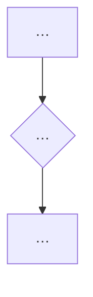

# Report spine

Reference for the `research` skill. The shared **conclusion-first 9-section spine** all three modes
(general / market / tech-selection) follow. Each mode fills the mode-specific 主体 (§3-§7); the
fixed sections (§1, §2, §8, §9) do not rename or reorder across modes.

## Why conclusion-first

A research report is read to decide, not to audit the research process. The reader wants the answer
first, the backing second. Reports that open with "目标 + 调研方法" bury the conclusion and force the
reader to assemble it from §6. Lead with the conclusion; let the body earn it.

## The 5-point spine

| § | Section | Purpose | Fixed? |
| --- | --- | --- | --- |
| 1 | 结论 (TL;DR) | Direct recommendations/judgments as bullets. Selection modes: "选什么." Surveys: "key takeaways about X." Reader knows the answer after this section. | ✅ |
| 2 | 核心认知 | 2-3 mental models + **one main thread** (see below) + ≥1 decision flowchart (mermaid). Every 主体 section must serve the main thread or be cut. | ✅ |
| 3-7 | 主体 | Organized by the dimension most useful to the reader's decision — by reader angle (tech-selection: 按X选/按画像), by sub-mode (market: 投资尽调/竞品/规模/技术供应商), or by subject dimension (general survey: 关系/实现/能力/局限/评估). Speed-tables dense + "按X选" subsections. | mode-specific |
| 8 | 避坑清单 | Numbered negative claims, each carrying evidence or a falsification trail (Step 4 output made visible). Prospective validation plans go in §9.4, not here. | ✅ |
| 9 | 源附录与核查记录 | 9.1 源 (by category + access date + reliability) · 9.2 负面断言核查记录 · 9.3 UNVERIFIED 项 · 9.4 访问限制与缺口 (incl. 后续验证计划) · 术语表 (optional — only if not all terms were inline-explained) | ✅ |

## The main thread

**One identifiable decision thread stated in §2**, in a single sentence, that every 主体 section
serves. Example from the reference report: "先选层,再选工具." §2 uses 2-3 认知模型 + a decision
flowchart to pin the thread; each 主体 section title connects to it. A section that does not serve
the thread is cut or rewritten — not kept because it was researched.

The thread is presence-checked, not clarity-scored: §2 must state it in one findable sentence, and
主体 section titles must connect to it.

## Mermaid rules

- §2 contains **≥1 decision flowchart** (all modes) — the main thread made visual.
- general mode: **≥3 mermaid** total (broad surveys earn the density).
- tech-selection / market: ≥1 (the §2 flowchart); add more only where they earn their place.
- **No "mixing flowchart and sequenceDiagram" requirement.** A flowchart-only report can be
  excellent. Use sequenceDiagram only when timing/call-chain is the information; never to satisfy a
  mixing rule.
- Every diagram serves information (routing/decision/timing/structure). Diagrams that decorate are
  removed.

## Format discipline

- **Tables for comparisons, lists, decisions** — prefer tables over prose. Speed-tables (候选 ×
  关键属性) are the workhorse of the 主体.
- **One sentence per idea.** No long stacked clauses. If a sentence has three commas rewriting it
  as a table row, rewrite the row.
- **Jargon inline-explained on first use**: `> **术语·X**: plain-language explanation`. Aggregate
  a glossary in §9 only if not all terms were inline-explained.
- **Cite at the claim**, inline (`[text](url)`), not only in §9.

## Shared skeleton shell

Fixed sections filled in; 主体 is the mode-specific placeholder.

```markdown
# [研究标题]
生成日期：YYYY-MM-DD
范围：[检索了什么、排除了什么]

## 1. 结论 (TL;DR)
- [结论 1，选型模式给"选什么"/survey 给"key takeaway"]
- [结论 2]

## 2. 核心认知
**主线**：[一句贯穿全文的决策主线]
[认知一：…。认知二：…。]


## 3-7. 主体
[模式特定——见各 mode ref。速查表 + 按X选子节，每节服务 §2 主线]

## 8. 避坑清单
1. [负面断言]——[证据/证否痕迹]
2. [负面断言]——[证据/UNVERIFIED + 搜索痕迹]

## 9. 源附录与核查记录
### 9.1 源参考
- [标题](url) — 访问：YYYY-MM-DD — 日期：[发布/更新或不可见] — 可靠性：[一级/二级] — 支持：[论点]
### 9.2 负面断言核查记录
- [断言]：搜索词 + org + 结果（found / not found / UNVERIFIED）
### 9.3 UNVERIFIED 项
- [无法在官方源证实或证伪的断言]
### 9.4 访问限制与缺口
- [访问限制 + 后续可调研/验证计划]
```

Mode refs fill the 主体 and show the complete skeleton. §1, §2, §8, §9 are fixed by this spine —
do not rename or reorder.
