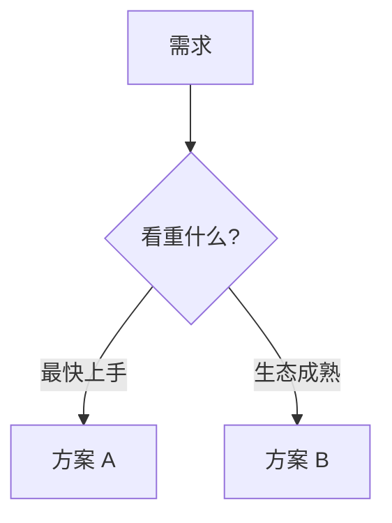

# Tech-selection mode

Reference for the `research` skill, **tech-selection** mode. Choosing or comparing a technology
stack, library, framework, open-source project, or repository for a concrete requirement. Produces a
defensible selection backed by GitHub evidence and official docs — not a popularity contest. Uses
the shared spine — see [references/report-spine.md](report-spine.md) for the fixed structure,
main-thread rule, mermaid rules, and shared skeleton.

## Contents

- [Clarify the requirement](#clarify-the-requirement)
- [Source priority](#source-priority)
- [Search GitHub first](#search-github-first)
- [Validate with official and community sources](#validate-with-official-and-community-sources)
- [9-section output template](#9-section-output-template)
- [Verify (tech-selection mode)](#verify-tech-selection-mode)

## Clarify the requirement

Restate: goal, constraints, platform, language/runtime, scale, budget, deadline, team skill,
must-haves, non-goals. Ask one concise question only if the requirement is too broad to search
usefully; otherwise state assumptions and proceed. The requirement frames the report header (范围
line) and the §2 decision tree — it is not a standalone section.

The selection dimensions (capability fit, integration cost, maturity, maintenance, license,
ecosystem, performance/scalability, security, deployment complexity, lock-in) are evaluated in
§7 维度核心结论, not listed up front.

## Source priority

| Priority | Source type | Use |
| --- | --- | --- |
| P0 | GitHub repos, README, docs folder, issues, PRs, releases, commits, license | Main evidence for fit and health |
| P1 | Official docs, blogs, release notes, package registry | Validate capabilities, versions, APIs, support policy |
| P2 | Technical blogs, Stack Overflow, Hacker News, Reddit | Discover adoption friction and operational pain |
| P3 | SEO listicles, marketing pages | Background only; never key evidence |

Final recommendations must be primarily supported by P0 and P1; use P2 to qualify confidence and
surface risks. If P0/P1 evidence is missing, lower confidence and state the gap.

## Search GitHub first

- Multiple angles: requirement keywords, domain terms, language/framework terms, "awesome" lists, example apps, benchmark repos, known alternatives.
- Collect at least five credible candidates before narrowing; if fewer exist, state why and compare the credible set.
- For each candidate: repo URL, description, primary language, license, stars/forks/watchers, latest commit or release date, release cadence, open issue/PR signal, docs/examples quality, package ecosystem, requirement fit.
- Do not rank by stars alone. Penalize stale maintenance, unclear license, missing docs, unresolved critical issues, high integration complexity.

## Validate with official and community sources

- Fetch official docs or release notes for capability claims, version compatibility, support status, limitations — cite inline at the claim, not in a separate evidence section.
- Search community sources for recurring operational problems, migration friction, missing features, production stories.
- Prefer recent evidence for fast-moving stacks; use exact dates for releases, commits, version claims.

For weighted scoring, build-vs-buy, TCO, migration-cost estimation, and the long-term-bet vs
commodity distinction — load [references/selection-rubric.md](selection-rubric.md).

## 9-section output template

Conclusion-first. §1/§2/§8/§9 are fixed by [report-spine.md](report-spine.md); the 主体 (§3-§7) is
organized by **reader angle** — by layer / by what you value / by user persona — mirroring how a
reader actually chooses. Default path: `docs/research/competitor.md`. If the file exists, append
`-2` or `-HHmmss`; overwrite only with explicit permission. Trim to fit, keep order and fixed sections.

| § | Section | Purpose |
| --- | --- | --- |
| 1 | 结论 (TL;DR) | The chosen option(s) + one-line rationale. "选什么." Reader knows the pick after this. |
| 2 | 核心认知 | 2-3 mental models (e.g. "选型先选层") + one main thread + decision flowchart (mermaid) encoding the requirement → choice path. |
| 3 | 候选总览 | Speed-table: all credible candidates × fit/maturity/maintenance/key tradeoff. |
| 4 | 按看重什么选 | "最快上手 / 生态成熟 / 互换最强 / 零成本" — route by the reader's priority. |
| 5 | 按用户画像 | "你是 X → 选 Y,因为 Z" — persona-to-recommendation table. |
| 6 | GitHub 仓库深度 | Per-candidate: repo, license, activity, strengths/weaknesses (evidence-backed), requirement fit. |
| 7 | 维度核心结论 | Per-dimension analysis (并行/互换/额度/数据源/成熟度…). Absorbs "为什么选" + "效果如何" — expected effect and success metrics as one dimension. Supports §1, doesn't restate it. |
| 8 | 避坑清单 | Numbered negative claims (e.g. "X 无官方 MCP" / "Y 已进维护模式"), each with evidence or falsification trail. |
| 9 | 源附录与核查记录 | 9.1 源 · 9.2 负面断言核查记录 · 9.3 UNVERIFIED 项 · 9.4 访问限制与缺口 (incl. 后续验证: prototype/benchmark/test plan). |

- ≥1 decision flowchart in §2; add more only where they earn their place. No "mixing" requirement.
- Tables dense (speed-tables are the workhorse); one sentence per idea; jargon inline-explained.

### Skeleton

````markdown
# [需求] 技术选型研究

生成日期：YYYY-MM-DD
范围：[目标/约束/假设/非目标，检索范围]
输出：[报告路径]

## 1. 结论 (TL;DR)
- **选 [方案]** — [一句话理由]
- [次选/备选 + 何时用]

## 2. 核心认知
**主线**：[一句决策主线，如"先选层，再选工具"]
[认知一：…。认知二：…。]


## 3. 候选总览
| 方案 | 仓库 | 适配 | 成熟度 | 维护 | 关键权衡 |
| --- | --- | --- | --- | --- | --- |
| [名] | [repo](https://github.com/org/repo) | [fit] | [signal] | [signal] | [tradeoff] |

## 4. 按看重什么选
- **最快上手**：[方案] — [理由]
- **生态成熟**：[方案] — [理由]

## 5. 按用户画像
| 你是 | 推荐 | 为什么 |
| --- | --- | --- |
| [画像] | [方案] | [理由] |

## 6. GitHub 仓库深度
### [候选]
- 仓库：[org/repo](https://github.com/org/repo) · License：[license] · 活动：[最新 release/commit]
- 优势：[证据支撑] · 劣势：[证据支撑] · 适配：[分析]

## 7. 维度核心结论
| 维度 | 证据 | 判断 |
| --- | --- | --- |
| 并行 | [来源](url) | … |
| 互换 | [来源](url) | … |

## 8. 避坑清单
1. [负面断言]——[证据/证否痕迹]
2. [负面断言]——[证据/UNVERIFIED + 搜索痕迹]

## 9. 源附录与核查记录
### 9.1 源参考
- [标题](<url>) — 访问：YYYY-MM-DD — 日期：[发布/更新或不可见] — 可靠性：[GitHub/官方/社区/二级] — 支持：[论点]
### 9.2 负面断言核查记录
- [断言]：搜索词 + org + 结果（found / not found / UNVERIFIED）
### 9.3 UNVERIFIED 项
- [无法在官方源证实或证伪的断言]
### 9.4 访问限制与缺口
- [访问限制 + 后续验证计划：prototype/benchmark/test]
````

## Verify (tech-selection mode)

- No unresolved placeholders (`TBD`, `[标题]`, `<source-url>`, `github.com/org/repo`).
- Every key recommendation, comparison point, repository health claim, and date-sensitive claim has a citation.
- §1 TL;DR is conclusion-first (names the pick); §2 核心认知 states one main thread and includes a decision flowchart.
- §8 避坑清单 present with numbered negative claims, each carrying evidence or a falsification trail.
- §9 has 9.2 负面断言核查记录 + 9.3 UNVERIFIED + 9.4 访问限制与缺口 (incl. 后续验证 plan).
- GitHub repository evidence + official documentation present when available; if community sources are low-signal, say so instead of forcing them.
- Stars alone did not drive the recommendation; maintenance, license, issue health, integration cost were weighed.
- No old blog post is treated as current capability evidence.
- Live sources were actually fetched; no "researched" claim when browsing was unavailable.
