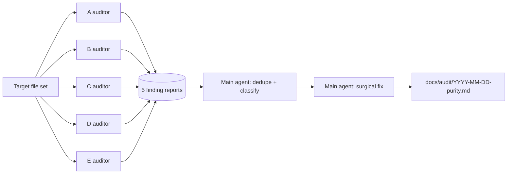

# Purity Audit — Subagent Dispatch

Reference for the `purity-audit` skill. When the audit target is large (a whole pack, >~20 files),
fan the 16-point checklist across per-category auditor subagents instead of one context. This is
the worked example: a constructed-context template, a filled Category-A prompt, and the synthesis
step. Adapted from `multi-agent-orchestration/references/dispatch-patterns.md`.

## Contents

- [Why subagents](#why-subagents)
- [Grain: one per category (5, not 16)](#grain-one-per-category-5-not-16)
- [Read-only audit, serialized fix](#read-only-audit-serialized-fix)
- [Constructed-context template per auditor](#constructed-context-template-per-auditor)
- [Worked example — Category A auditor](#worked-example--category-a-auditor)
- [Synthesis](#synthesis)

## Why subagents

A pack-scale purity audit runs all 16 points over dozens of files — too much for one context window,
and category-to-category contamination biases the read (a finding in A colors the D judgment). Five
isolated auditors each hold one category's 3–4 points and nothing else → cleaner reads + parallel
throughput.

## Grain: one per category (5, not 16)

| Subagent | Category | Points | Method |
|---|---|---|---|
| A auditor | 溯源残留 | A1–A3 | grep-driven |
| B auditor | 装饰与冗余 | B4–B7 | grep + judgment |
| C auditor | 死内容 | C8–C10 | grep + link-check |
| D auditor | doc/impl 裂隙 | D11–D14 | judgment |
| E auditor | 语言与平台残留 | E15–E16 | judgment |

Per-point (16 subagents) is overkill — each category's points share a method, so one auditor runs
them together. Five is the natural grain.

## Read-only audit, serialized fix

Subagents **report** findings; the main agent **fixes**. Auditing is read-only → parallel-safe
(disjoint reads, no race). Fixing edits shared files → must serialize to the main agent, or five
auditors collide on the same SKILL.md. Never give an auditor subagent write access to the target.

## Constructed-context template per auditor

A subagent's prompt is its entire world — it has no access to the conversation, prior decisions, or
files you've read unless you put them in the prompt.

```
## Goal
Audit <target> for <category> residue only; return a findings list. Do not fix.

## Inputs
- Target files: <exact list or glob>
- Checklist points (paste verbatim): <the category's points from purity-checklist.md>
- Grep commands to run: <the category's 怎么查 commands>

## Boundaries
- In scope: only <category> points against the listed target.
- Out of scope: every other category; any fix; any file not listed.
- Report each finding as: {point, file, line, evidence, fix}.

## Verify target
Every point in <category> is addressed (finding or explicit "none"). Each finding has file:line +
a concrete fix. Output is the findings array — no edits to any file.

## Isolation note
You have no access to any prior session or conversation. This prompt is your entire context. Don't
assume state or files not stated above. If something is missing, ask — don't guess.
```

## Worked example — Category A auditor

The filled prompt to dispatch for Category A (溯源残留):

```
## Goal
Audit the engineering-skills pack's skills/ and references/ for Category A (tracing residue)
only; return a findings list. Do not fix.

## Inputs
- Target files: skills/**/SKILL.md, skills/**/references/*.md, references/*.md
- Checklist points (verbatim):
  A1 标签式溯源 — section titles / brackets carrying version or event: （v2.8 新增）（XX 事件）（已观测）（保留）.
     怎么查: grep （.*新 / （.*保留 / （.*事件 / （.*已观测.
  A2 正文嵌版本号/变更指针 — "自 vX 起…" / "详见 CHANGELOG" / "之前是 X 现改为 Y" / "原来用 A 现迁移到 B".
     怎么查: grep v[0-9]\.[0-9] in prose (exclude frontmatter / badges / dep declarations); any 之前/原来/改为/迁移到/升级后 phrasing.
  A3 分组按批次而非维度 — sections grouped by add-order (baseline / existing / a batch), not by dimension.
     怎么查: delete every section title's tracing word — does the grouping still make sense? If not, the grouping itself is residue.
- Grep commands:
  grep -rnE '（.*(新|保留|事件|已观测)' skills/ references/
  grep -rnE 'v[0-9]\.[0-9]' skills/ references/   # then exclude frontmatter / badges / dep lines by eye
  grep -rnE '之前|原来|改为|迁移到|升级后' skills/ references/

## Boundaries
- In scope: only A1, A2, A3 against the listed targets.
- Out of scope: categories B–E; any fix; files outside skills/ and references/.
- Report each finding as: {point, file, line, evidence, fix}.

## Verify target
A1, A2, A3 each addressed (finding(s) or explicit "none"). Each finding has file:line + a concrete
fix. Output is the findings array only — no file edits.

## Isolation note
You have no access to any prior session or conversation. This prompt is your entire context. If a
file is unreadable or a grep fails, say so — don't guess.
```

Expected return (illustrative — placeholders, not real findings):

```json
[
  {"point":"A2","file":"<skill>/SKILL.md","line":NN,"evidence":"自 v2.8 起…","fix":"state the current fact; drop the version pointer"},
  {"point":"A1","file":"<reference>.md","line":NN,"evidence":"（v2.9 新增）","fix":"delete the tag"}
]
```

## Synthesis

Collect all five reports. A residue can trip two categories — a version tag inside a dead link is
both A2 and C9; label both, fix once. Dedupe, classify each finding to its point-id, then the main
agent applies the surgical fixes (purity-audit Step 6) and writes the report. The end-to-end verify
is the main agent's, not the subagents' — per-piece "found" ≠ whole "clean".



## References

- [purity-checklist.md](../../../../references/purity-checklist.md) — the 16 points each auditor runs a slice of.
- `multi-agent-orchestration` dispatch-patterns ([../../../../skills/04-develop/multi-agent-orchestration/references/dispatch-patterns.md](../../../../skills/04-develop/multi-agent-orchestration/references/dispatch-patterns.md)) — the source context-construction template and review-checkpoint patterns.
